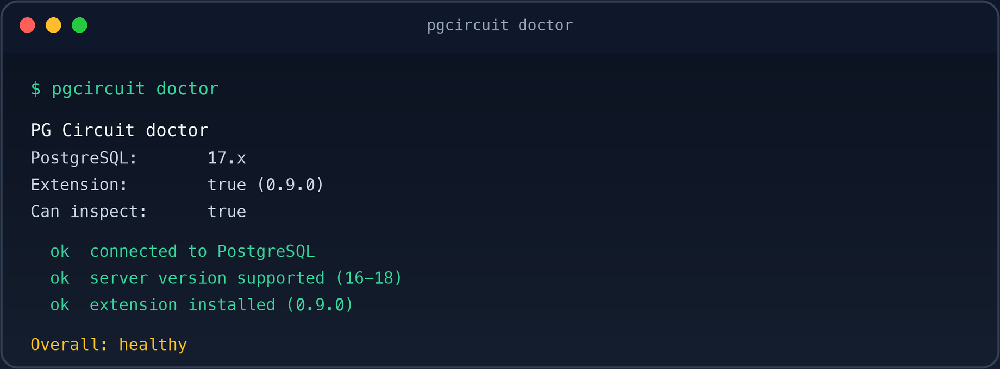

<p align="center">
  
</p>

<p align="center">
  <strong>PG Circuit Community</strong><br/>
  A circuit breaker for production PostgreSQL · Apache 2.0
</p>

<p align="center">
  <a href="https://github.com/PG-Circuit/pg-circuit/actions/workflows/ci.yml"></a>
  <a href="LICENSE"></a>
  <a href="https://www.postgresql.org/"></a>
  <a href="https://github.com/PG-Circuit/pg-circuit/releases"></a>
  <a href="https://pgcircuit.com"></a>
</p>

<p align="center">
  <a href="https://pgcircuit.com">Website</a> ·
  <a href="https://pgcircuit.com/docs">Docs</a> ·
  <a href="CHANGELOG.md">Changelog</a> ·
  <a href="https://github.com/PG-Circuit/pg-circuit/issues">Issues</a>
</p>

---

## What this is

**Community** is the free Apache 2.0 on-box breaker:

- SQL parsing and basic dangerous-query detection
- `UPDATE` / `DELETE` without `WHERE`, `TRUNCATE`, `DROP`
- Destructive DDL rules (ALTER / INDEX / REINDEX / VACUUM FULL / CLUSTER)
- Local config + basic CLI (`status`, `runtime`, `blockers`, `events`, `doctor`)
- On-box WARN/BLOCK event history

> Basic dangerous-query protection stays free forever. No phone-home license check.

Native extension · Deterministic risk · Observe / warn / enforce

Commercial Pro / Cloud / Enterprise options (policies, blast-radius scoring, assess/preflight, incidents, fleet UI, support) are documented on [pgcircuit.com/pricing](https://pgcircuit.com/pricing) — this repo is Community only.

---

## What it does

Migration linters see SQL before deploy. They cannot see that sessions are blocked or that transactions have been open for hours.

**PG Circuit runs inside PostgreSQL.** It inspects the statement *and* the live runtime state, then **ALLOW / WARN / BLOCK** — with an explainable score, not a black box.

```sql
DELETE FROM users;
```

```text
ERROR:  PG Circuit [PGC001] blocked high-risk operation
DETAIL:  Risk: 95/100
        Estimated rows: 3
        Relation: public.users
        Operating mode: enforce
        Runtime mode: NORMAL
        Pressure: 0/100
        Replication lag: 0.0s
        Decision: BLOCK
HINT:  retry in smaller batches (add WHERE); then SELECT * FROM pg_circuit_events() and pg_circuit_explain_risk(...); adjust pg_circuit.mode or risk_*_threshold
```

Community effective runtime mode stays **NORMAL**. Pressure may still appear in DETAIL / `pg_circuit_runtime_state()` — it is display-only and does not escalate mode.
---

## Why not “just another guardrail”

| | Migration linter | Proxy / ORM | **PG Circuit** |
|--|:----------------:|:-----------:|:--------------:|
| Sees SQL | ✓ | ✓ | ✓ |
| Sees live lag / locks / pressure | ✗ | partial | **✓** |
| Enforces inside the backend | ✗ | ✗ | **✓** |
| Works with any client | — | depends | **✓** |
| Deterministic, explainable rules | sometimes | varies | **✓** |

Not an AI wrapper. Not a SaaS dashboard. Not telemetry. A native PostgreSQL extension under [Apache 2.0](LICENSE).

---

## How it works

```text
SQL ──► cheap classify (parse / plan trees)
          ├── safe / simple  → fast path
          └── risky
                → runtime snapshot (display)
                → risk factors (PGC001…)
                → observe | warn | enforce
```

1. Hooks into PostgreSQL (`planner_hook`, `ProcessUtility_hook`; executor hooks chained for coexistence).
2. Classifies from AST/plan — **not regex**. Safe ops skip runtime collection.
3. Scores 0–100 from independent factors with stable rule IDs.
4. Applies your mode: `observe` · `warn` · `enforce`.

Community always reports effective runtime mode **NORMAL**. Pressure signals are still collected for display via `pg_circuit_runtime_state()`.

---

## Quick start

**Simplest path:** Docker (preloads `pg_circuit` for you). After install you still need `CREATE EXTENSION`, then a WARN/BLOCK smoke test below.

Hooks and the in-memory event ring require `shared_preload_libraries = 'pg_circuit'` **and a PostgreSQL restart**. Managed Postgres (RDS, Aurora, Cloud SQL, …) often cannot load custom preload libraries — use self-hosted or Docker.

<details open>
<summary><strong>Docker</strong> (recommended)</summary>

```bash
docker compose build
docker compose up -d
# compose maps host port 54329 → 5432
docker compose exec postgres psql -U postgres -c "CREATE EXTENSION pg_circuit;"
```

</details>

<details>
<summary><strong>From source</strong> (Linux · PostgreSQL 16/17/18)</summary>

```bash
make && sudo make install
# postgresql.conf → shared_preload_libraries = 'pg_circuit'
# REQUIRED: restart PostgreSQL after changing shared_preload_libraries
psql -c "CREATE EXTENSION pg_circuit;"
```

</details>

<details>
<summary><strong>macOS</strong> (Homebrew)</summary>

```bash
brew install postgresql@17
export PATH="$(brew --prefix postgresql@17)/bin:$PATH"
make && make install
```

Confirm install paths with `pg_config --sharedir` / `pg_config --pkglibdir`. Restart PostgreSQL after setting `shared_preload_libraries`, then `CREATE EXTENSION pg_circuit;`.

</details>

### Smoke test

```sql
CREATE EXTENSION pg_circuit;
CREATE TABLE users (id int);
INSERT INTO users VALUES (1);

SET pg_circuit.mode = enforce;
DELETE FROM users;              -- blocked: PGC001
DELETE FROM users WHERE id = 1; -- allowed
```

### When blocked (operator loop)

```text
pgcircuit doctor
pgcircuit status          -- mode + thresholds (effective runtime = NORMAL)
pgcircuit runtime         -- pressure display-only in Community
pgcircuit events          -- recent WARN/BLOCK
```

```sql
SELECT * FROM pg_circuit_events();
SELECT * FROM pg_circuit_explain_risk('delete_no_where', 0, 0, 'normal', 0);
```

---

## Modes

```text
pg_circuit.mode         = observe | warn | enforce     (default: warn)
pg_circuit.runtime_mode = normal | protect | emergency | auto  (default: normal)
```

| `mode` | Behavior |
|--------|----------|
| `observe` | Score only — quiet |
| `warn` | Warnings, never blocks |
| `enforce` | Blocks when risk ≥ `risk_block_threshold` (default **80**) |

`runtime_mode` is accepted for compatibility; Community **always** resolves effective mode to `NORMAL`.

---

## Risk engine

Scores are **deterministic**, explainable, and clamped to 0–100. No AI. No ML. No network calls.

| Score | Level |
|------:|-------|
| 0–19 | INFO |
| 20–39 | LOW |
| 40–59 | MEDIUM |
| 60–79 | HIGH |
| 80–100 | CRITICAL |

### Community rules

| ID | Rule | Base |
|----|------|-----:|
| PGC001 | DELETE without WHERE | 95 |
| PGC002 | UPDATE without WHERE | 95 |
| PGC003 | TRUNCATE | 90 |
| PGC004 | DROP TABLE | 95 |
| PGC005 | DROP DATABASE | 100 |
| PGC012–PGC016 | DDL: ALTER / INDEX / REINDEX / VACUUM FULL / CLUSTER | varies |

Large-write blast-radius rules (PGC006/PGC007), pressure-escalation additives, policies, and assess/preflight are Pro.

### DDL & locks

Classifies utility commands from parse trees (`ALTER TABLE` subtypes, `CREATE INDEX` vs `CONCURRENTLY`, `REINDEX`, user `VACUUM FULL` / `CLUSTER` — never autovacuum).

```sql
SELECT * FROM pg_circuit_blockers();
SELECT * FROM pg_circuit_lock_summary();
```

---

## Configuration

| GUC | Default |
|-----|--------:|
| `pg_circuit.enabled` | `on` |
| `pg_circuit.mode` | `warn` |
| `pg_circuit.runtime_mode` | `normal` |
| `pg_circuit.risk_warn_threshold` | `50` |
| `pg_circuit.risk_block_threshold` | `80` |
| `pg_circuit.long_transaction_seconds` | `300` |
| `pg_circuit.replication_lag_warning_seconds` | `10` |
| `pg_circuit.replication_lag_critical_seconds` | `30` |
| `pg_circuit.event_history_size` | `256` *(restart)* |
| `pg_circuit.wal_pressure_elevated_bps` | `16 MiB/s` |
| `pg_circuit.wal_pressure_high_bps` | `64 MiB/s` |
| `pg_circuit.fail_closed` | `off` |
| `pg_circuit.debug` | `off` |

---

## SQL API

```sql
SELECT pg_circuit_version();
SELECT * FROM pg_circuit_status();        -- mode + configured/effective runtime (effective = NORMAL)
SELECT * FROM pg_circuit_runtime_state(); -- pressure_score + pressure_explain (display-only)
SELECT * FROM pg_circuit_events();

SELECT * FROM pg_circuit_explain_risk('delete_no_where', 0, 0, 'normal', 0);
SELECT * FROM pg_circuit_explain_risk_ex(
  'alter_table', 0, 5::bigint * 1024^3, 'normal', 0, 9, 2, 12);
SELECT * FROM pg_circuit_blockers();
SELECT * FROM pg_circuit_lock_summary();
```

`pressure_explain` states that Community effective mode is always NORMAL while listing pressure contributors.

---

## CLI

```bash
go build -o bin/pgcircuit ./cmd/pgcircuit

pgcircuit status --dsn "$DATABASE_URL"
pgcircuit runtime --format json
pgcircuit blockers
pgcircuit events
pgcircuit doctor
```

<p align="center">
  
</p>

**Docs:** [CLI](docs/cli/README.md) · [Hardening](docs/hardening.md) · [Operations](docs/operations.md) · [Architecture](docs/architecture.md)

---

## Architecture

```text
SQL → cheap classify
        ├── safe/simple → fast path
        └── potentially risky
                → runtime state → risk factors → decision
                → WARN / BLOCK → shared-memory event ring
```

- **C** owns enforcement inside the backend.
- **Go** owns the external `pgcircuit` CLI — never embedded in backend processes.

---

## Performance

Runtime state is collected **only** after a statement is classified as potentially risky. No network I/O, no subprocesses, no telemetry by default.

```sql
SELECT avg(score) FROM generate_series(1, 100000) g,
  LATERAL pg_circuit_explain_risk('delete_no_where', 0, 0, 'normal', 0);
```

---

## Limitations

- Row counts are planner estimates (clamped to a physical page ceiling) — not exact `COUNT(*)`.
- Relation size uses the main fork only.
- Replication lag uses WAL sender reply-time age; no replicas ⇒ `0`.
- Event history is in-memory and bounded; resets on restart.
- Effective runtime mode is always NORMAL in Community.

---

## Compatibility · Security · Develop

| | |
|--|--|
| PostgreSQL | **16 · 17 · 18** |
| License | [Apache 2.0](LICENSE) |
| Security | [SECURITY.md](SECURITY.md) · **security@pgcircuit.com** |
| Support | [SUPPORT.md](SUPPORT.md) |
| Conduct | [CODE_OF_CONDUCT.md](CODE_OF_CONDUCT.md) |
| Trademark | [TRADEMARK.md](TRADEMARK.md) |

```bash
make && make installcheck
go test ./...
go build -o bin/pgcircuit ./cmd/pgcircuit
make docker-test
```

See [CONTRIBUTING.md](CONTRIBUTING.md).

---

## Edition boundaries

| | Community (this repo) |
|--|----------------------|
| License | Apache 2.0 — free forever |
| Scope | Dangerous SQL / DDL floor, local config, basic CLI, on-box logs |
| Runtime | Effective mode always NORMAL; pressure visible but display-only |
| Phone-home | Never |

Pro adds on-box policies, blast-radius, assess/preflight, incidents, and richer runtime. Cloud / Enterprise are separate commercial offerings on [pgcircuit.com](https://pgcircuit.com) — not part of this repository. Brand: [TRADEMARK.md](TRADEMARK.md). Packaging: [PACKAGING.md](PACKAGING.md).

---

<p align="center">
  <sub>PG Circuit Community · adaptive runtime protection · <a href="https://pgcircuit.com">pgcircuit.com</a></sub>
</p>
